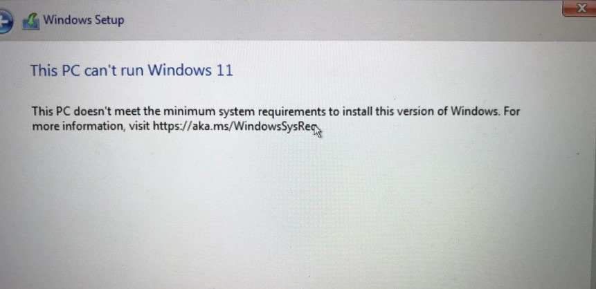
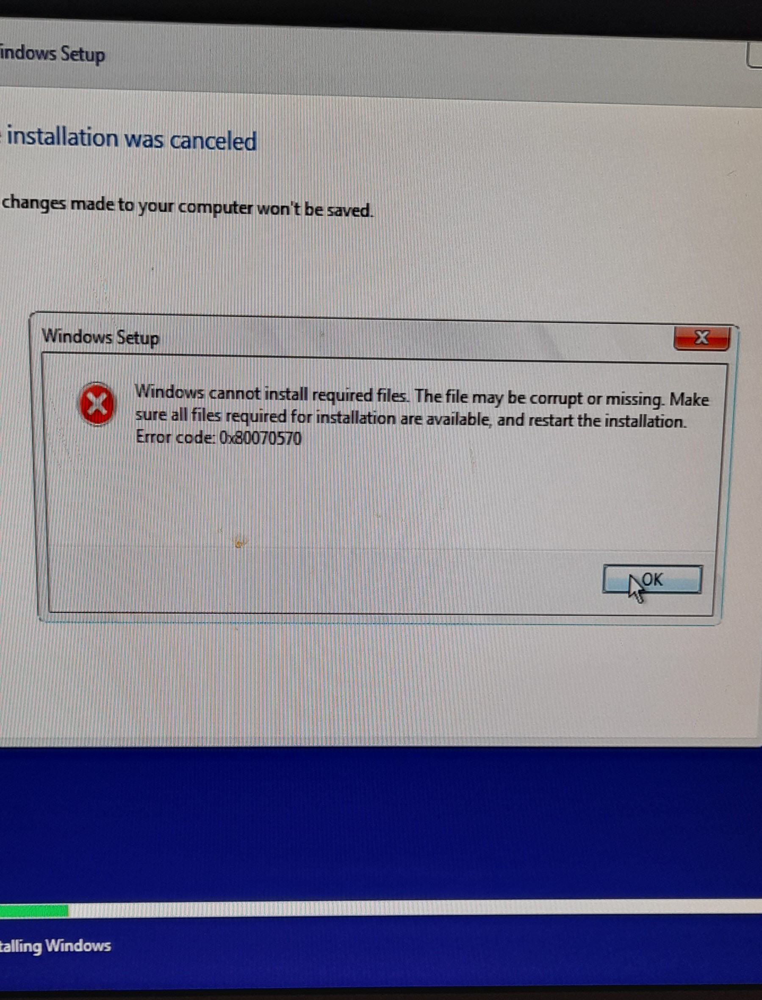

# Windows Installation Errors

## This PC can’t run Windows 11
when i wanted to install windows 11 on a new motherboard i saw this error:

    This PC can’t run Windows 11
    This PC doesn’t meet the minimum system requirements to install this version of Windows. For more information, visit https://aka.ms/WindowsSysReq.
    
so i searched whole web and found this answer to my problem.

<ul>
<li>1.go the first page when you see installation bottun.press <code>shift+F10</code></li>
<li>2. type <code>regedit</code> and hit enter</li>
<li>3.in <code>HKEY_LOCAL_MACHINE</code> and on <code>setup</code> and create a new key <code>LabConfig</code> in this section create a new Dword32bit called <code>BypassTPMCheck</code> and also <code>BypassSecureBootCheck</code></li>
<li>4.Edit both vlaues to 1</li>
<li>5.and its finished and you can now install windows 11 without any problem.</li>
</ul>

## Error 0x80070570
only reason this happend was that my usb flash drive was damaged electronically!!!

